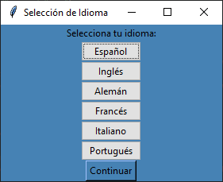
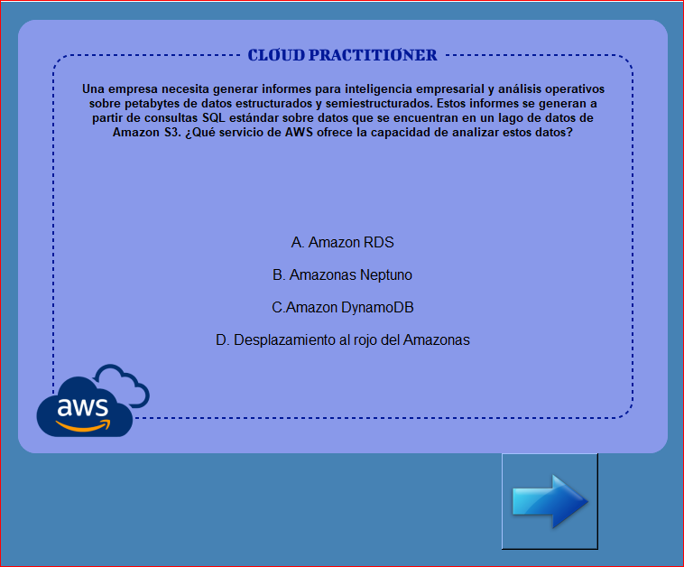
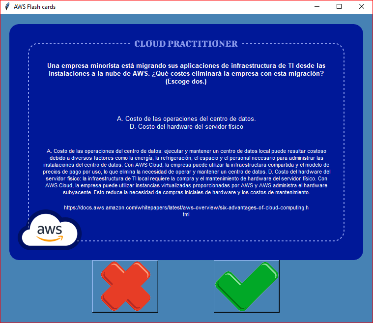
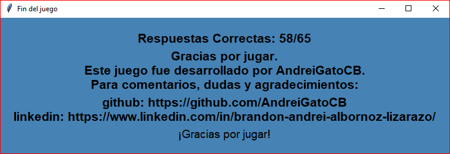

# **AWS CLOUD PRACTITIONER FLASHCARDS**

## Este juego es un simulacro del examen "AWS Cloud Practitioner"

### Cuenta con función multilingüe.

Para seleccionar el idioma dar click en el idioma escogido y después en 'Continuar'. El idioma original y por lo tanto 
el más confiable es inglés.

### Luego se encuentra la cara frontal de la flashcard. 

Acá se encuentra el texto de la pregunta y las opciones de respuesta. El botón de la flecha lo puedes usar para girar la
carta y ver la respuesta correcta.

### Luego se encuentra la parte trasera de la flashcard.

En esta se encuentran:
- la pregunta. 
- La o las respuestas correctas. 
- La argumentación de dichas respuestas. 
- Un enlace para profundizar más en la argumentación, este enlace queda copiado automáticamente en el portapapeles, así 
que sólo hace falta abrir una nueva pestaña en el navegador y oprimir control+v para ir a la documentación. 
- Un botón con una equis en rojo (cuando has seleccionado la respuesta incorrecta, o no sabías la respuesta deberás tocar este botón).
- Un botón con un checkmark en verde (cuando hayas seleccionado la respuesta correcta deberás tocar este botón).

### Al finalizar el test aparecerá una nueva ventana

En esta pantalla se encuentra el puntaje y los créditos del juego.

- El test está formado por 65 preguntas.
- El test está diseñado para tardar 90 minutos en ser resuelto (sin ir a la documentación oficial para profundizar en las 
respuestas).

